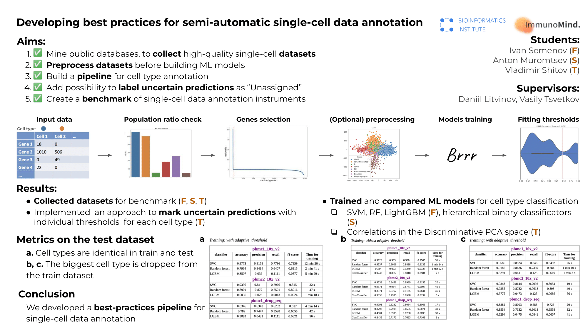

# Developing best practices for semi-automatic single-cell data annotation

**Single-cell sequencing** is paving the way for precision medicine. It is the next step towards making precision medicine more accurate. One of the most important step in single-cell data analysis is **cell type labeling**. This is a very time-consuming process, the automation of which is a task of current interest.

The goal of this project is using modern machine learning approaches to build semi-automatic single-cell data annotation tool.
        
Authors:
- Ivan Semenov
- Anton Muromtsev
- Vladimir Shitov 

Supervisors:
- Daniil Litvinov
- Vasily Tsvetkov

The project was made for the [ImmunoMind Inc](https://immunomind.io) as a part of the education at the [Bioinformatics Institute](https://bioinf.me/en/education).

# Graphical abstract

# Datasets

# Trained models

## Support Vector Machine Classifier

## Random Forest Classifier

## LightGBM Classifier

## Correlations Classifier

## Hierarchical binary classificators

# Labelling the unassigned cells
