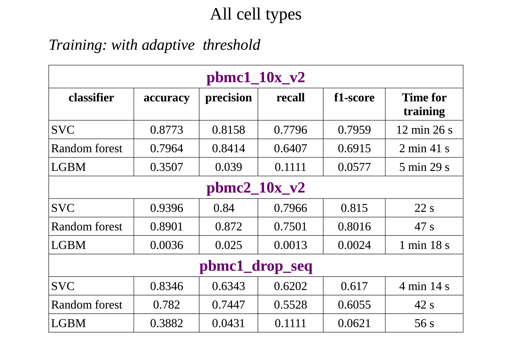

# Developing best practices for semi-automatic single-cell data annotation

**Single-cell sequencing** is paving the way for precision medicine. It is the next step towards making precision medicine more accurate. One of the most important step in single-cell data analysis is **cell type labeling**. This is a very time-consuming process, the automation of which is a task of current interest.

The goal of this project is using modern machine learning approaches to build semi-automatic single-cell data annotation tool.
        
Authors:
- Ivan Semenov
- Anton Muromtsev
- Vladimir Shitov 

Supervisors:
- Daniil Litvinov
- Vasily Tsvetkov

The project was made for the [ImmunoMind Inc](https://immunomind.io) as a part of the education at the [Bioinformatics Institute](https://bioinf.me/en/education).

# Graphical abstract


# Aims
1. Mine public databases, to collect high-quality single-cell datasets
1. Preprocess datasets before building ML models
1. Build a pipeline for cell type annotation
1. Add possibility to label uncertain predictions as “Unassigned”
1. Create a benchmark of single-cell data annotation instruments

# Results
- Collected datasets for benchmark
- Implemented  an approach to mark uncertain predictions with individual thresholds  for each cell type
- Trained and compared ML models for cell type classification:
- - Support Vector Machine Classifier (showed the 
- - Random Forest Classifier
- - LightGBM Classifier
- - Hierarchical binary classificators
- - Classificator based on the correlations in the Discriminative PCA space

# Datasets
We used datasets from the work of Abdelaal et al [1]. Datasets are available via the [link](https://zenodo.org/record/3357167#.YokrjC8Rp-V). We evaluated our models on the following datasets:
- 10Xv2_pbmc1
- 10Xv3_pbmc1
- DR_pbmc1

# Obtained metrics

All the models below were trained on the dataset pbmc1_10x_v2 and tested on the other datasets.

## Cell types are identical in train and test

**Figure 1.** Metrics on the test datasets without prediction of unassigned cells


**Figure 2.** Metrics on the test datasets with prediction of unassigned cells


## The biggest cell type is present in the test, but not in the train dataset

**Figure 3.** Metrics on the test datasets without prediction of unassigned cells


**Figure 4.** Metrics on the test datasets with prediction of unassigned cells


Conclusions:
- Support Vector Machine Classifier shows the best f1-score 
- If the model is trained on the data from one protocol (e.g. 10X), it performs good at the different data from the same protocol. However, for the data from different protocol (e.g. Dropseq), metrics are worse. Train you model on the data from suitable protocol!

# Labelling the unassigned cells
Some classifiers can produce some certanty measure of the prediction (e.g. probabillity). It can be used to mark uncertain predictions. But how to define an optimal threshold for the classificator? Duan et al [2] suggested using the 1st percentile of the certanty for each class. E. g. such value that 99% of cells of that class have the higher certainty.

**Figure 5.** Example of the threshold identification for NK cells. It is the 1st percentile of correlations of NK cells with NK cells cluster centroid


Such an approach can be used to build a classifier based on correlations. Duan et al [2] use the correlations in the Dicriminative PCA (DCA) space. We also implemented this approach.

**Figure 6.** Example of the dimensionality reduction of single-cell expression data with PCA and DCA


For example, let's say that we have 8 cell types in our training dataset. We calculated the following thresholds using the correlations in the DCA space.

| Cell type  | Certainty threshold |
| ------------- | ------------- |
| B cells  | 0.8476  |
| CD14 Monocytes  | 0.564  |
| CD4 T | 0.3201 |
| CD8 T | 0.5483 |
| Dendritic | 0.9094 |
| FCGR3A Monocytes | 0.0833 |
| Megakaryocytes | 0.9869 |
| NK | 0.7986 |

Now we are calculating the correlations of a cell from test dataset to each cell type's cluster centroid. The highest correlation is with the NK cells cluster and equals to 0.723. Does it mean that this cell is NK cell? No, we label it as "unasiigned" because the certainty in prediction (correlation in this case) is less than the corresponding threshold.

The same approach can be used for any model, which predicts some certainty in prediction. You can use [CalibratedClassifier](https://github.com/ipsemenov/ImmunoMind_project/blob/main/scripts/sclearn/classifiers.py#L10) to do so:

```python
model = RandomForestClassifier()
model.fit(X, y)  # Where X contains information about genes expression for each cell, and y contains cells types
classifier = CalibratedThresholdsClassifier(model, cv=3)
classifier.fit(X, y)
classifier.predict(X_test)  # Predicts not only cells types from train, but also "unassigned" class
```

# Running the code

1. Install dependencies:

```bash
$ pip install -r requirements.txt
```

2. Entrypoint for the code is the file [main.py](scripts/main.py) in the scripts directory. It has two modes:

## Training models
```
usage: main.py train [-h] -i -0 -P --models [...] - -n_genes --threshold --n_jobs
optional arguments:
-h, --help      show this help message and exit
-i, --input     Path to scRNA-seq dataset(s)
-o, --output    Path to the folder with results
-p , --path     Path to the folder with models
--models [...]  Names of the models to train. Available: svc, rforest, lgbm, corr
--n_genes       Number of genes to select for models training
--threshold     1 - if we want to use adaptive threshold, else 0
--n jobs        Number of jobs to run in parallel.
```

## Making predictions
```bash
usage: main. py predict [-h] -i -o -p --models [...] --n_genes --benchmarking --n_jobs
-h, --help      show this help message and exit
-i, --input     Path to scRNA-seq dataset(s)
-o, --output    Path to the folder with results
-p , --path     Path to the folder with models
--models [...]  Names of the models to train. Available: svc, rforest, lgbm, corr
--n_genes       Number of genes to select for models training
--benchmarking  0 if we want to run benchmarking, else 1
--n jobs        Number of jobs to run in parallel.
```

# References
1. Abdelaal, T., Michielsen, L., Cats, D. et al. A comparison of automatic cell identification methods for single-cell RNA sequencing data. Genome Biol 20, 194 (2019). https://doi.org/10.1186/s13059-019-1795-z
2. B. Duan, C. Zhu, G. Chuai, C. Tang, X. Chen, S. Chen, S. Fu, G. Li, Q. Liu, Learning for single-cell assignment. Sci. Adv. 6, eabd0855 (2020)
